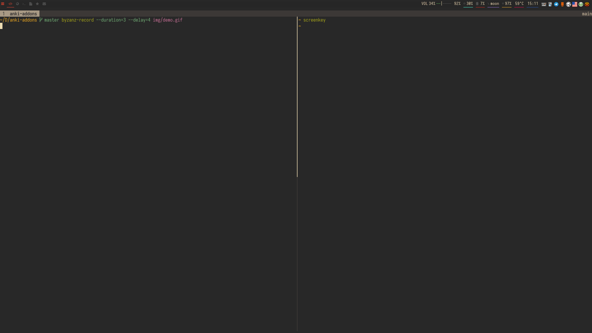

# AnkiTray

Yet another addon that adds an icon to the system tray and allows minimizing anki to the tray.

## Installation

To download this add-on, please copy and paste the following code into Anki 2.1: `1072672680`.

## Usage

This addon is suitable for use with tiling window managers. It allows you to
quickly add cards using a keyboard shortcut. The following screencast
demonstrates `anki_tray` with i3wm:



For this setup you should save [util/raise-anki.py](./util/raise-anki.py) and add the following lines in i3 configuration file:

```
# You will need to replace Title depending on your l10n
for_window [class="^Anki$" title="^Добавить$"] floating enable, mark anki_add

bindsym $mod+Control+a exec $SCRIPTS_PATH/raise-anki.py && sleep 0.2 && i3-msg '[con_mark="anki_add"] move workspace current' && i3-msg '[con_mark="anki_add"] focus'
```
